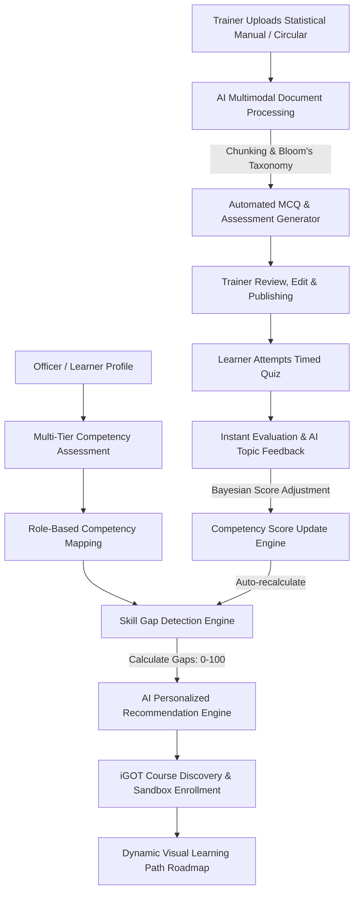

# StatIQ — AI Skill Intelligence & Personalized Learning Platform

[](https://www.sih.gov.in/)
[](https://spring.io/projects/spring-boot)
[](https://react.dev/)
[](https://fastapi.tiangolo.com/)
[](https://www.postgresql.org/)
[](LICENSE)

> **Empowering Capacity Building in India's Official Statistical System (MoSPI, NSSO, State DES)** through automated competency evaluation, gap analysis, iGOT Karmayogi course alignment, and document-to-assessment AI generation.

---

## 🏛️ Context & Problem Statement (SIH26101)

The **Official Statistical System of India**—spearheaded by the **Ministry of Statistics and Programme Implementation (MoSPI)**, the **National Sample Survey Office (NSSO)**, and **State Directorates of Economics and Statistics (DES)**—demands high rigor in survey methodologies, national accounts, price statistics, agricultural and industrial indices, data privacy, and modern data science (AI/ML, GIS, Python, R, Stata).

However, continuous professional capacity building faces critical hurdles:
1. **Static Training Delivery:** Training programs are often uniform rather than targeted to an officer's specific role requirements and current capability.
2. **Hidden Competency Gaps:** Difficulty in identifying exact mathematical, computational, or governance deficiencies across a dispersed statistical cadre.
3. **Assessment Authoring Bottleneck:** Faculty and master trainers spend excessive manual hours drafting MCQs and assessments from dense survey manuals, census guidelines, and national accounting methodology papers.
4. **Ecosystem Silos:** Under-utilization of the government's centralized capacity-building initiative, **Mission Karmayogi (iGOT Karmayogi)**.

### The StatIQ Solution
**StatIQ** is an enterprise-grade AI Skill Intelligence & Personalized Learning Platform designed specifically for statistical officers and government data analysts. It creates a **closed-loop feedback system**:
$$\text{Learner Profile} \longrightarrow \text{Skill Gap Engine} \longrightarrow \text{iGOT Recommendations} \longrightarrow \text{AI Document Ingestion} \longrightarrow \text{Auto Quiz Evaluation} \longrightarrow \text{Dynamic Competency Score Update}$$

---

## ⚠️ Important Hackathon Disclaimer: iGOT Karmayogi Integration

> **Official Notice:** The current hackathon prototype uses a **Mock iGOT Provider (`MockIGotCourseProvider`)** because production iGOT Karmayogi API credentials and government intranet gateway access are not publicly distributed for hackathon development. 
> 
> The platform adheres to clean **Enterprise Service Provider Interfaces (`IGotCourseProvider`)**. This guarantees that the `MockIGotCourseProvider` can be swapped with the production `IGotApiCourseProvider` with zero changes to the user interface, business logic, or recommendation engine. In the user interface, all iGOT courses and enrollments are explicitly branded as **"iGOT Integration — Prototype / Sandbox"**.

---

## 🔄 Core End-to-End Workflow & Continuous Feedback Loop



---

## 🌟 Key Platform Capabilities

### 1. Multi-Dimensional Competency Framework
Designed specifically around official statistical operations across 4 pillars:
* **Statistical Domain:** Survey Design, Sampling Techniques, National Accounts & GDP, Price Statistics (CPI/WPI), Labour Statistics, Agricultural & Industrial Statistics (IIP/ASI), SDG Indicators, Data Quality Frameworks (NDSAP/DQAF).
* **Technical & Analytics:** Python for Data Analytics, R for Biostatistics, SQL & Relational Databases, Stata, SPSS, GIS & Spatial Analysis, AI/ML in Official Statistics, Cloud Computing, Open Data Protocols.
* **Digital Governance:** Cybersecurity for Public Data, Data Privacy & DPDP Act Compliance, Digital Signatures, Government Community Cloud, Digital Public Infrastructure (DPI).
* **Leadership & Management:** Public Administration Leadership, Data Communication, Statistical Project Management, Professional Ethics, Evidence-based Decision Making.

### 2. Intelligent Skill Gap Engine
Computes granular gaps between the officer's current verified capability and the target benchmark for their specific job role (e.g., *Statistical Investigator*, *Statistical Analyst*, *Data Processing Officer*, *GIS Analyst*).
$$\text{Gap} = \text{Required Competency Level} - \text{Current Competency Level}$$
* **Strong (0–10):** Ready for mentorship and specialized projects.
* **Moderate Gap (11–25):** Targeted micro-learning suggested.
* **Significant Gap (26–50):** Structured course series assigned.
* **Critical Gap (51–100):** High-priority foundational training mandated.

### 3. Automated AI Document Ingestion & MCQ Generator
* Ingests official documentation: **PDF**, **DOCX**, **PPTX**, **TXT** (e.g., NSS 78th Round Manual, National Accounts Statistics bluebook).
* Extracts, normalizes, sanitizes, and chunks text with semantic boundary preservation.
* Generates balanced multi-choice questions with 4 options, rigorous single correct answer, difficulty ratings, Bloom's Taxonomy categorization, and explanatory citations.
* Supports Trainer review, interactive inline question editing, re-generation, and one-click assessment publishing.

### 4. Interactive Quiz Evaluation & Competency Updating
* Timed, progressive quiz interface with category breakdowns and real-time navigation.
* Instant grading with automated error analysis and AI-driven diagnostic feedback.
* **Closed-loop score updater:** Adjusts the learner's verified competency score dynamically without volatile overwrites:
$$\text{Score}_{\text{new}} = \alpha \cdot \text{Score}_{\text{old}} + (1 - \alpha) \cdot \text{AssessmentScore}$$
* Instantly triggers cascade recalculations of skill gaps, personalized recommendations, and learning roadmaps.

### 5. Role-Based Dashboards & Analytics
* **Learner:** Dynamic radar charts, gap metrics, learning paths, interactive iGOT sandbox catalog, quiz attempts, and 24/7 AI Learning Assistant.
* **Trainer:** Material repository, automated question generation studio, assessment manager, learner performance tracking.
* **Admin / Ministry Executive:** Workforce skill health index, critical gap distributions across departments, training completion ratios, emerging technology adoption metrics, and exportable reports.

---

## 🏗️ Architecture & Technology Stack

```
statiq-ai-learning-platform/
├── frontend/               # React 18, TypeScript, Vite, Tailwind CSS, Recharts, Lucide
│   ├── src/
│   │   ├── api/            # Axios API clients for all backend endpoints
│   │   ├── components/     # Enterprise UI components, Sidebar, Navbar, Modals
│   │   ├── context/        # Auth and notification contexts
│   │   ├── pages/          # Learner, Trainer, Admin, Auth views
│   │   └── types/          # TypeScript domain models
├── backend/                # Java 21/24, Spring Boot 3.3.4, Spring Security, Flyway, JPA
│   ├── src/main/java/org/statiq/
│   │   ├── config/         # Security, CORS, JWT, OpenAPI
│   │   ├── controller/     # REST Controllers
│   │   ├── dto/            # Request and Response Data Transfer Objects
│   │   ├── entity/         # Relational JPA Entities
│   │   ├── enums/          # Roles, Competency Categories, Gaps
│   │   ├── igot/           # IGotCourseProvider interface & Mock implementation
│   │   ├── repository/     # Spring Data JPA Repositories
│   │   ├── security/       # JWT Filters, UserDetails
│   │   └── service/        # Business logic services
│   └── src/main/resources/
│       ├── application.yml # Spring configuration
│       └── db/migration/   # Flyway SQL migrations (V1 schema, V2 seed)
├── ai-service/             # Python 3.13, FastAPI, Pydantic, Extractors, LLM Abstraction
│   ├── extractors/         # PDF, DOCX, PPTX, TXT extractors
│   ├── providers/          # AIProvider interface, MockAIProvider, LLMProvider
│   ├── services/           # MCQ generation, quiz evaluator, AI chatbot
│   └── main.py             # FastAPI REST endpoints
├── docs/                   # Detailed technical documentation
│   ├── architecture.md
│   ├── api.md
│   ├── database.md
│   ├── ai-engine.md
│   ├── deployment.md
│   └── demo-script.md
└── screenshots/            # UI captures & workflow assets
```

---

## 👥 Demo Accounts & Credentials

The platform is pre-seeded with three comprehensive role accounts (password for all demo accounts is `Statiq@2025`):

| Role | Email | Password | Primary Role & Assignment |
| :--- | :--- | :--- | :--- |
| **Learner** | `learner@statiq.gov` | `Statiq@2025` | Statistical Analyst (NSSO Socio-Economic Division) |
| **Trainer** | `trainer@statiq.gov` | `Statiq@2025` | Senior Faculty (National Statistical Systems Training Academy - NSSTA) |
| **Admin** | `admin@statiq.gov` | `Statiq@2025` | Director General / Workforce Administrator (MoSPI) |

---

## 🚀 Quickstart & Installation

### Prerequisites
* **Java:** JDK 21+ (Java 24 supported)
* **Maven:** 3.8+ (Configured in PATH)
* **Node.js:** v18+ (Node 24 supported) & npm
* **Python:** 3.11+ (Python 3.13 supported)
* **PostgreSQL:** 15+ (Running locally on default port `5432` with database `statiq`)

### 1. Database Setup
```bash
# Connect to PostgreSQL and create database (if not already done)
psql -U postgres -c "CREATE DATABASE statiq;"
```

### 2. Backend (Spring Boot)
```bash
cd backend
mvn clean compile
mvn spring-boot:run
# Backend will start on http://localhost:8080
# Flyway will automatically execute database migrations and seed demo data.
```

### 3. AI Microservice (FastAPI)
```bash
cd ai-service
python -m venv venv
# On Windows:
.\venv\Scripts\activate
# On Linux/macOS:
source venv/bin/activate

pip install -r requirements.txt
uvicorn main:app --host 0.0.0.0 --port 8000 --reload
# AI microservice will start on http://localhost:8000
```

### 4. Frontend (React + Vite)
```bash
cd frontend
npm install
npm run dev
# Frontend will start on http://localhost:5173
```

---

## 🧪 Comprehensive End-to-End Demo Script

1. **Learner Journey (`learner@statiq.gov`):**
   * Log in and view the **Executive Learner Dashboard** displaying current competency ratings (AI/ML at 35, Python at 45).
   * Navigate to **Skill Gaps** to see gap calculations against the *Statistical Analyst* benchmark.
   * View **Personalized Recommendations** and click on **iGOT Course Discovery**.
   * Enroll in the simulated iGOT course *"Applied Machine Learning for National Statistics"*.
   * View the dynamically mapped **Personalized Learning Path** roadmap.
2. **Trainer Journey (`trainer@statiq.gov`):**
   * Navigate to **Material Upload** and upload a statistical methodology manual (PDF/DOCX/TXT).
   * Launch **Question Generator**, select 10 questions at *Mixed* difficulty.
   * Review AI-extracted MCQs, edit question stems and distractors, and click **Publish Assessment**.
3. **Assessment & Feedback Loop:**
   * Switch back to Learner, attempt the newly published quiz.
   * Review immediate AI feedback on strengths and weaknesses.
   * Observe **automatic update of the competency score** (AI/ML updates from 35 $\rightarrow$ 78).
   * Observe instant recalculation of skill gaps and refreshed iGOT course recommendations!
4. **Admin Journey (`admin@statiq.gov`):**
   * Inspect ministry-wide workforce analytics, department heatmaps, training progress, and critical vacancy gaps.

---

## 📄 License
This project is licensed under the MIT License. Developed for Smart India Hackathon (SIH) Problem Statement **SIH26101**.
