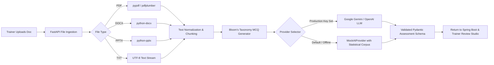

# StatIQ AI Engine & MCQ Generation Architecture

## Architecture Overview
The StatIQ AI Service is a dedicated Python FastAPI microservice that offloads document parsing, semantic text chunking, and intelligent assessment generation from the core Spring Boot application.

## 1. Document Extraction Pipeline
* **PDF Extractor:** Parses hierarchical text streams, removes headers, footers, page numbering, and normalizes table representations.
* **DOCX Extractor:** Extracts paragraph runs, headings, and bullet points into unified markdown.
* **PPTX Extractor:** Iterates over slides, text frames, and speaker notes to synthesize learning points.
* **Semantic Chunker:** Splits long documents into overlapping context windows (1,000–1,500 tokens with 200 token overlap) to ensure questions maintain holistic context.

## 2. MCQ Generation Engine
The generator prompts the AI model with strict guidelines:
* 4 distinct options per question.
* Avoid trivial "All of the above" or "None of the above" where possible.
* Include Bloom's Taxonomy cognitive level: *Remembering*, *Understanding*, *Applying*, *Analyzing*, or *Evaluating*.
* Provide thorough pedagogical explanations for why the correct answer is right and why distractors are incorrect.
* Reference the specific section or paragraph of the source document.

## 3. Provider Abstraction
The system defines an abstract base class `AIProvider`:
* `MockAIProvider`: Ships out-of-the-box with pre-curated question sets covering India's National Accounts, Consumer Price Index calculation, NSSO survey sampling frameworks, and machine learning for official statistics. Guarantees 100% functionality without requiring external API keys.
* `GeminiLLMProvider`: Dynamically active when `GEMINI_API_KEY` is present in the environment.
* `OpenAILLMProvider`: Dynamically active when `OPENAI_API_KEY` is present in the environment.

## 4. Continuous Competency Adjustment Algorithm
When a learner finishes an assessment, competency scores are updated using an exponential moving average:
$$S_{new} = \alpha \cdot S_{current} + (1 - \alpha) \cdot S_{exam}$$
Where $\alpha = 0.65$, weighting historical proven performance while reflecting recent mastery or regression.
