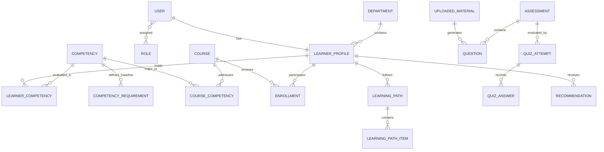

# StatIQ Database Schema & Data Dictionary

## Overview
StatIQ uses **PostgreSQL 18** with Flyway version-controlled migrations. The schema handles multi-tenant departmental organizations, competencies, learners, courses, assessments, and continuous feedback records.

## Core Tables
1. **users:** User credentials, email, password hash (BCrypt), active status, timestamps.
2. **roles:** System roles (`ROLE_LEARNER`, `ROLE_TRAINER`, `ROLE_ADMIN`).
3. **user_roles:** Join table mapping users to roles.
4. **departments:** MoSPI divisions (e.g., NSSO Socio-Economic Division, National Accounts Division, Economic Statistics Division).
5. **learner_profiles:** Officer employee ID, designation, educational background, years of experience, current assignment.
6. **competencies:** Master competency taxonomy across Statistical, Technical, Digital Governance, and Managerial categories.
7. **learner_competencies:** Continuous score rating (0–100), last updated timestamp, confidence level.
8. **competency_requirements:** Baseline required score (0–100) per job role and department.
9. **courses:** Catalog courses including title, provider, duration, difficulty, syllabus.
10. **course_competencies:** Many-to-many relationship mapping courses to target competencies with expected uplift.
11. **enrollments:** Officer course enrollment status, progress percentage, completion date.
12. **learning_paths:** Generated roadmaps based on identified skill gaps.
13. **learning_path_items:** Ordered course sequence in a learning roadmap.
14. **uploaded_materials:** Training materials (PDF, DOCX, PPTX, TXT) uploaded by trainers with extraction metadata.
15. **assessments:** Diagnostic or topic quizzes authored or generated from materials.
16. **questions:** Question stem, 4 options, correct answer index, explanation, difficulty, topic.
17. **quiz_attempts:** Learner exam attempts, score, accuracy, submission timestamp, AI feedback summary.
18. **quiz_answers:** Granular question-level user response, correctness flag.
19. **recommendations:** System-generated course recommendations with priority rationale.
